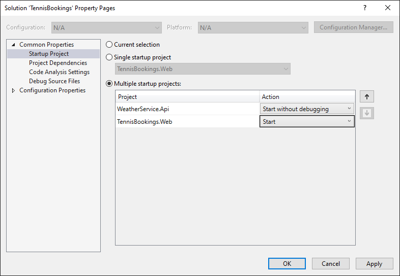

# Integration Testing ASP.NET Core Applications: Best Practices

This download contains a Visual Studio solution and the project files from Module 4.

# Prerequisites

- .NET Core SDK 3.1+
- Visual Studio 2019 or alternative editor

# Configuration Steps Required to Run Sample

1: Open the TennisBookings.sln in Visual Studio.

*If prompted with a security warning, deselect "Ask me for ever project in this solution" and click "OK".*

2: Set multiple startup projects...

- Right click on the solution and choose "Set Startup Projects".

- Choose "Multiple startup projects"

Set `WeatherService.Api` as "Start without debugging" and `TennisBookings.Web` as "Start".

- Ensure `WeatherService.Api` is moved to the top of the list.

- Click "OK" to close the solution properties window.

## Credentials

To login to the Tennis Booking web application as an administrator, use the following credentials.

- Username = admin@example.com
- Password = Password1!

To login to the Tennis Booking web application as a member, use the following credentials.

- Username = member@example.com
- Password = Password1!

# Troubleshooting

** If the TennisBookings website cannot reach the WeatherService.API, the ports may be incorrectly configured **

1: Expand the `WeatherService.Api` project and open the "launchSettings.json" file.

2: Copy the auto-generated iisExpress application URL from the file.

3: Open the appSettings.json file inside the `TennisBookings.Web` application.

4: Paste the copied URL as the value for the "WeatherApiUrl" under "ExternalServices"

# Configuration

It is also possible to disable the weather forecast feature which will remove the need for the WeatherService API to be running.

Open the appsettings.json file for the TennisBookings.Web application.

Under the section Features > WeatherForecasting, set the value for 'EnableWeatherForecast' to 'false.